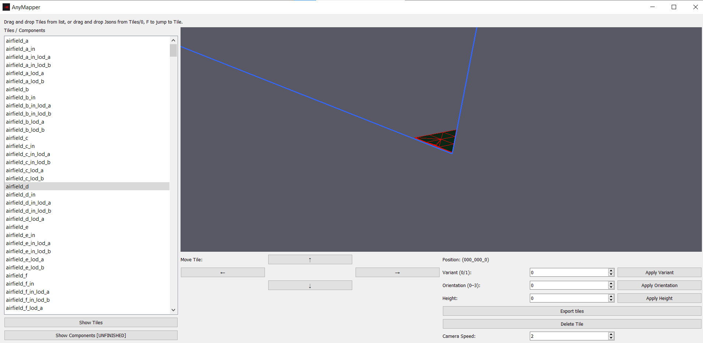
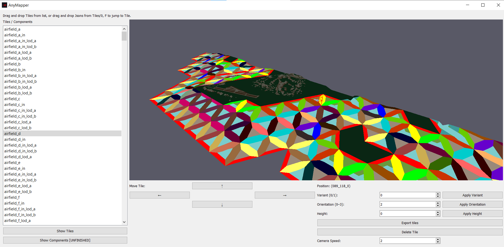

# This is a Alpha program, undiscovered bugs are to be expected and performance is a big issue for the time being, that will be worked on. If any bugs are found, feel free to report them.

Note, This program wont work unless its placed in the main directory of anymaker.

Anymapper, A simple to use map editor for anymaker, V0.0.1 was designed around V0.0.26 of AnyMaker.
Supports features of drag and drop jsons from inside anymakers tiles/0 file, Auto positions them on the grid.
Roads, Props, Houses, and more editor features are to come later on.

Features the options to drag pre existing Jsons into the editor.

